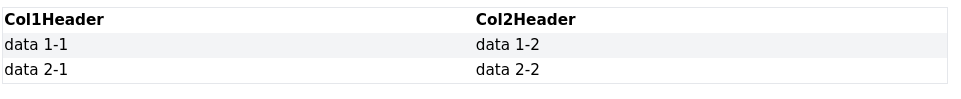
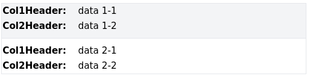

# Tailwind Table Responsive

  

adapts a table to a responsive format that can be viewed on small screens (mobile)  
Initially it works with Tailwind CSS but can be adapted to any other framework

big screen table


small screen - data is aligned vertically  


## How it works

- it scans the page for tables according to a given selector (default table.adaptToMobile)
- Add a <span> tag in each td cell with the name of the related <th> header
- Adds a class so you can use a media query to display a better looking table on smaller screens
- by default it's configured to work with tailwind css, but it can be easily adapted to any other library


## Usage

Download the library and insert along with the css file it into your page 
```
<link href="https://unpkg.com/tailwindcss@^2/dist/tailwind.min.css" rel="stylesheet">
<link rel="stylesheet" href="./style.css">
<script src="/dist/table-responsive.min.js"></script>
```
Enable it after the page is loaded
```
const config = {
    // default table selector
    tables: document.querySelectorAll('table.adaptToMobile'), 
    // default classes that are added to the element 
    classes: ["inline-block", "sm:hidden", "w-1/4", "font-bold"], 
}
adaptTableToMobile(config);
```


