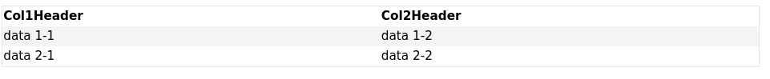
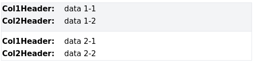

# Table Responsive


Adapts HTML tables to a stacked layout on small screens. Works with plain CSS; no framework required.

big screen table


small screen - data is aligned vertically


## How it works

- Scans the page for tables (default: `table.adaptToMobile`)
- Injects a label `<span>` in each cell from the matching `<th>` text (hidden from assistive tech; real headers stay in the accessibility tree)
- CSS stacks rows on viewports below 640px and shows those labels
- Optional: pass custom `classes` if you want different label styling hooks

## Usage

```html
<link rel="stylesheet" href="/dist/styles.css">
<script src="/dist/table-responsive.min.js"></script>

<table class="adaptToMobile">
  <thead>
    <tr>
      <th>Name</th>
      <th>Email</th>
    </tr>
  </thead>
  <tbody>
    <tr>
      <td>Ada</td>
      <td>ada@example.com</td>
    </tr>
  </tbody>
</table>

<script>
  adaptTableToMobile();
</script>
```

Optional config:

```js
adaptTableToMobile({
  tables: document.querySelectorAll('table.adaptToMobile'),
  classes: ['adaptToMobile-label'],
});
```
